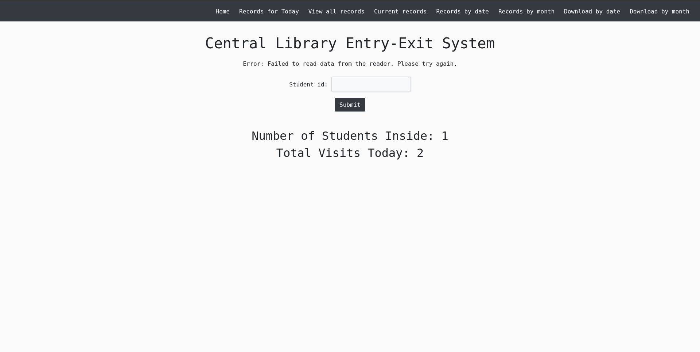
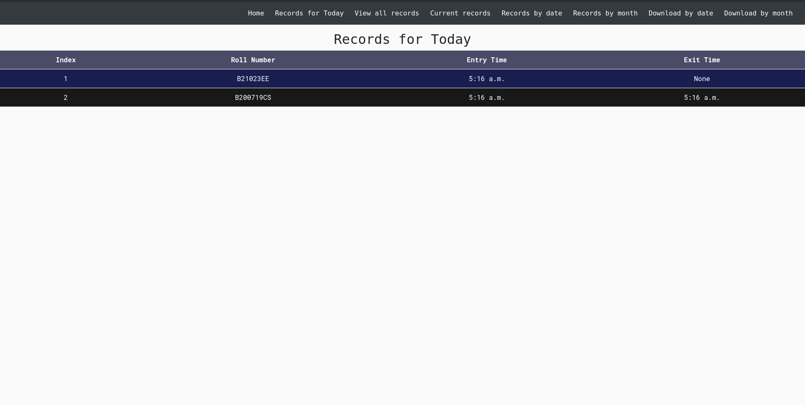

## Entry Exit DL

A Django application to record the entry and exit of students into the library by scanning their ID cards using an RFID reader.

### System Requirements

- Python 3.7 or above
- Git
- RFID Reader with compatible RFID cards
- Ubuntu 20.04 or higher (for Linux installation) or Windows 10/11 (for Windows installation)
- Access to the same network for both the server and the RFID reader

### Installation

#### Ubuntu

1. Update package lists:

```bash
sudo apt update
```

2. Install required packages:

```bash
sudo apt install git python3-pip python3-virtualenv
```

3. Clone the repository:

```bash
git clone https://github.com/AfthabEK/Entry-Exit-DL.git
cd Entry-Exit-DL
```

4. Create and activate a virtual environment:

```bash
virtualenv venv
source venv/bin/activate
```

5. Install the project dependencies:

```bash
pip3 install -r requirements.txt
```

6. Configure the RFID reader IP in `views.py` inside the `enter` folder.

7. Run the Django development server:

```bash
python3 manage.py migrate
python3 manage.py runserver
```

#### Windows

1. Install Python 3.x from the official website: https://www.python.org/downloads/

2. Install Git for Windows from: https://git-scm.com/download/win

3. Open a command prompt or Git Bash.

4. Clone the repository:

```bash
git clone https://github.com/AfthabEK/Entry-Exit-DL.git
cd Entry-Exit-DL
```

5. Create and activate a virtual environment:

```bash
python -m venv venv
venv\Scripts\activate
```

6. Install the project dependencies:

```bash
pip install -r requirements.txt
```

7. Configure the RFID reader IP in `views.py` inside the `enter` folder.

8. Run the Django development server:

```bash
python manage.py migrate
python manage.py runserver
```


#### Docker
1. Install Docker on your system. Refer to the official documentation for instructions: https://docs.docker.com/get-docker/

2. Clone the repository:

```bash
git clone https://github.com/AfthabEK/Entry-Exit-DL.git
cd Entry-Exit-DL
```

3. Build the Docker image:

```bash
docker build -t entry-exit-dl .
```

4. Run the Docker container:

```bash
docker run -d -p 8000:8000 entry-exit-dl
```   


## Usage

1. Ensure the RFID reader is connected and accessible on the same network as the server.

2. Put the card on the RFID reader.

3. Open your web browser and go to `localhost:8000` or `http://your-server-ip:8000`.

   

4. Click on the "Submit" button after the RFID reader successfully reads the card.

   - Successful Read and Student Entry:
   

   - Successful Read and Student Exit:
   

   - Failed Read:
   

5. To view all records, click on the "View Records" link from the navigation menu.

   

6. To see the list of students currently inside, click on the "Current Records" link from the navigation menu.

   

7. To view the list of students who entered today, click on the "Records for Today" link from the navigation menu.

   

8. To view the list of students on a specific day, click on the "View by Date" link from the navigation menu.

9. To view the list of students for a specific month, click on the "View by Month" link from the navigation menu.

10. To download student data for a specific date, click on the "Download by Date" link from the navigation menu.

11. To download student data for a specific month, click on the "Download by Month" link from the navigation menu.

### Admin Tasks

* To clear the database and delete all data, run the `clear.py` script. **Warning**: Make sure to backup data by downloading it before running this script.

* To delete all entries with a specific prefix, run the clear_prefix.py script.

* To set the status of all entries as exit, run the update_exit.py script.  

### Notes
This software was made for the [eSSL U-5 RFID reader](https://www.esslsecurity.com/rfidreaders/u-5).
 If you are using a different device, please make sure to modify the readData
function in [views.py](/enter/views.py).

## Contribution
Contributions are always welcome! Feel free to create a pull request, and I'll review it promptly.
Please try to fix the following issues:
   - Change UI: the current UI is very basic. Try adding a collapsible navigation bar on the left side. Any other improvements to the current UI can also be done
   - Add a logic to logout the students at the end of a shift, and then enter them back in as a student in the next shift. For example, if a student comes in at 3pm and goes out at 4 pm. Make a logic to have the student logout at 4:30, and back in at 4:31pm.
   - Add a graph representations of students entry exit based on branch, year and shift. The roll number is in this format: "B200719CS", where B stands for B.Tech/B.Arch(M for M.Tech,P for PHD) the next two digits "20" stands for 2020, meaning the student took admission in 2020. That student is in his 4th year so to identify the year: If it monsoon semester(August to December) Year=current year-xy -2000 + 1, where x and y are the second and third digits. I it is winter semester(January to July)  Year=current year-xy -2000. The last to represent the branch.

