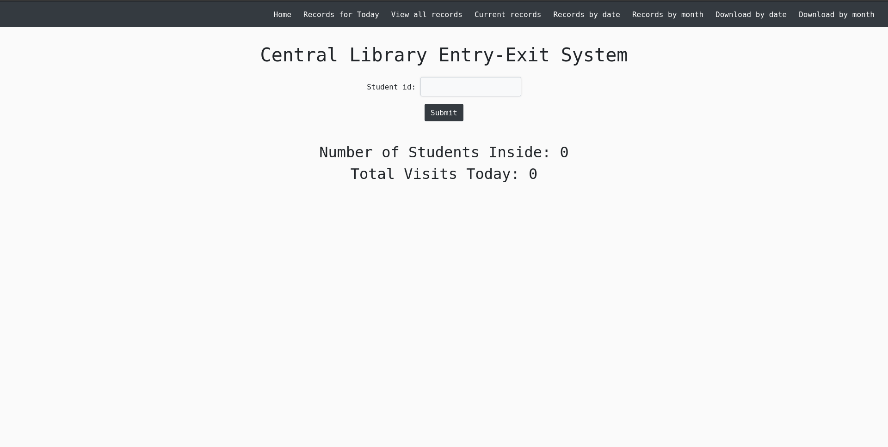
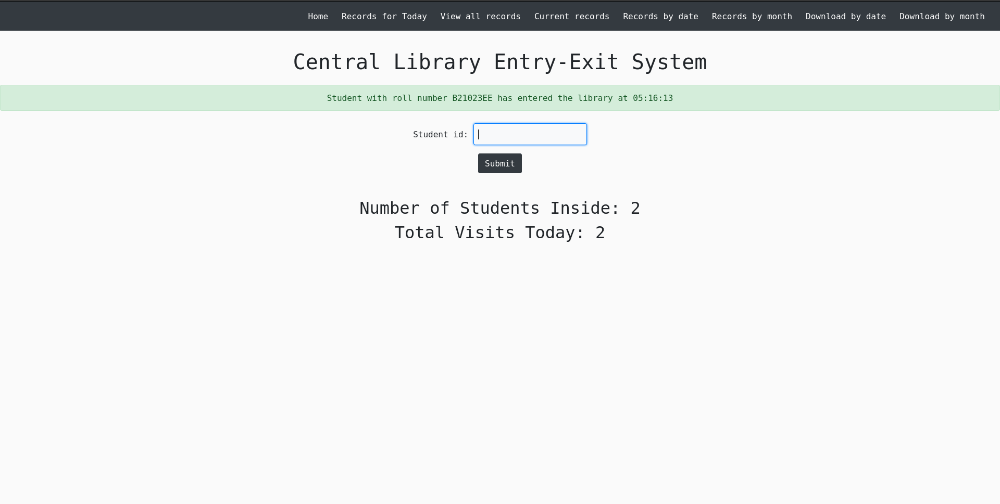
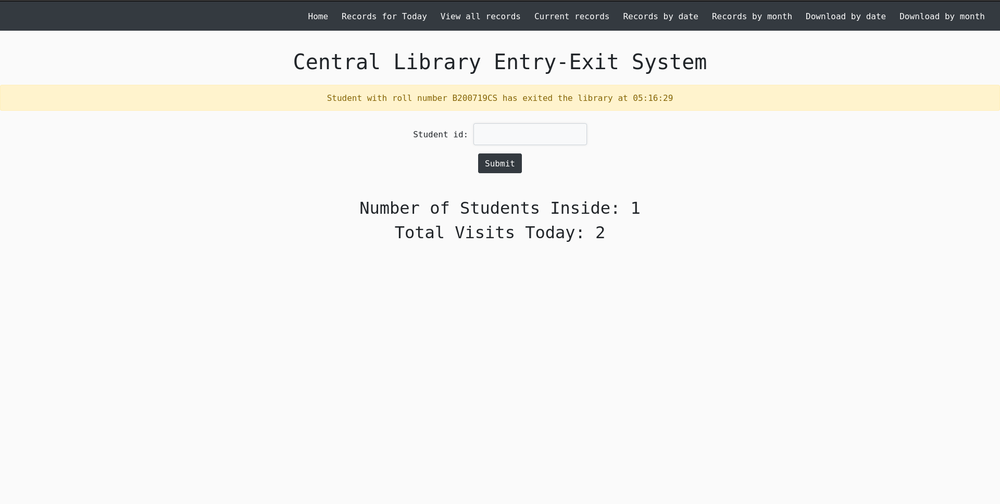

To create a comprehensive README file for your Django project, you should include the following sections:

## Entry Exit DL

Entry-Exit Student Data Recording System

### System Requirements

- Python 3.7 or above
- Git
- RFID Reader with compatible RFID cards
- Ubuntu (for Linux installation) or Windows (for Windows installation)
- Access to the same network for both the server and the RFID reader

### Installation

#### Ubuntu

1. Update package lists:

```bash
sudo apt update
```

2. Install required packages:

```bash
sudo apt install git python3-pip python3-virtualenv
```

3. Clone the repository:

```bash
git clone https://github.com/AfthabEK/Entry-Exit-DL.git
cd Entry-Exit-DL
```

4. Create and activate a virtual environment:

```bash
virtualenv venv
source venv/bin/activate
```

5. Install the project dependencies:

```bash
pip3 install -r requirements.txt
```

6. Configure the RFID reader IP in `views.py` inside the `enter` folder.

7. Run the Django development server:

```bash
python3 manage.py runserver
```

#### Windows

1. Install Python 3.x from the official website: https://www.python.org/downloads/

2. Install Git for Windows from: https://git-scm.com/download/win

3. Open a command prompt or Git Bash.

4. Clone the repository:

```bash
git clone https://github.com/AfthabEK/Entry-Exit-DL.git
cd Entry-Exit-DL
```

5. Create and activate a virtual environment:

```bash
python -m venv venv
venv\Scripts\activate
```

6. Install the project dependencies:

```bash
pip install -r requirements.txt
```

7. Configure the RFID reader IP in `views.py` inside the `enter` folder.

8. Run the Django development server:

```bash
python manage.py runserver
```

### Usage

1. Ensure the RFID reader is connected and accessible on the same network as the server.


To add the usage instructions and additional information to the README file, you can include the following sections:

## Usage

1. Put the card on the RFID reader.

2. Open your web browser and go to `localhost:8000` or `http://your-server-ip:8000`.

   

3. Click on the "Submit" button after the RFID reader successfully reads the card.

   - Successful Read and Student Entry:
   

   - Successful Read and Student Exit:
   

   - Failed Read:
   

4. To view all records, click on the "View Records" link from the navigation menu.

   

5. To see the list of students currently inside, click on the "Current Records" link from the navigation menu.

   

6. To view the list of students on a specific day, click on the "View by Date" link from the navigation menu.

7. To view the list of students for a specific month, click on the "View by Month" link from the navigation menu.

8. To download student data for a specific date, click on the "Download by Date" link from the navigation menu.

9. To download student data for a specific month, click on the "Download by Month" link from the navigation menu.

### Admin Tasks

To clear the database and delete all data, run the `clear.py` script. **Warning**: Make sure to backup data by downloading it before running this script.

## Contribution
Contributions are always welcome! Feel free to create a pull request, and I'll review it promptly. Your help is much appreciated!
